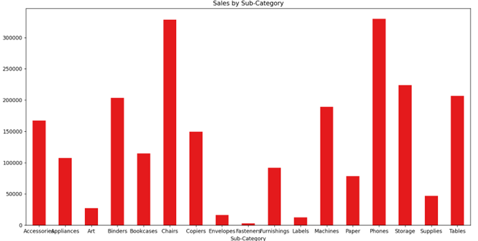

# VizHelper

VizHelper is a lightweight Python module that enhances Matplotlib visualizations by applying user-centered design improvements. It declutters plots, applies a colorblind-friendly palette, auto-rotates x-axis labels, auto-generates legends and labels, produces descriptive alt-text (using heuristics or, optionally, the OpenAI API), and enables interactive hover tooltips.

VizHelper is designed for both novice and advanced users, making it easy to create accessible, readable, and well-formatted plots with minimal extra code.

## Table of Contents

- [Overview](#overview)
- [Features](#features)
- [Installation](#installation)
  - [Local Installation](#local-installation)
  - [Installing from PyPI](#installing-from-pypi)
- [Usage Examples](#usage-examples)
  - [Example 1: Bar Chart](#example-1-bar-chart)
  - [Example 2: Scatter Plot](#example-2-scatter-plot)
  - [Example 3: Line Chart](#example-3-line-chart)
- [Before and After Comparison](#before-and-after-comparison)
- [Detailed Functionality](#detailed-functionality)
  - [enhance_plot()](#enhance_plot)
  - [User Profiles](#user-profiles)
  - [Auto-Rotation of X-Axis Labels](#auto-rotation-of-x-axis-labels)
  - [Alt-Text Generation](#alt-text-generation)
  - [Interactivity](#interactivity)
- [Configuration Options](#configuration-options)
- [Future Work](#future-work)
- [Contact](#contact)

## Overview

VizHelper enhances Matplotlib plots by:
- **Decluttering:** Removing extra spines and adjusting tick parameters.
- **Accessibility:** Applying a colorblind-friendly palette by default.
- **Dynamic Label Rotation:** Automatically rotates x-axis labels based on the number of categories.
- **Auto-Legend & Auto-Labeling:** Generating legends and labeling data points (bar heights or line endpoints).
- **Alt-Text Generation:** Creating descriptive alt-text for plots using heuristics or (optionally) the OpenAI API.
- **Interactivity:** Enabling hover tooltips for interactive data inspection.
- **Configurable Settings:** Allowing users to customize default behaviors and user profiles.

## Features

- **Decluttering:**  
  Removes top and right spines to create a cleaner look.
  
- **Color Accessibility:**  
  Uses a colorblind-friendly palette to improve readability.

- **Dynamic Label Rotation:**  
  Automatically rotates x-axis labels (0°, 45°, or 90°) based on the number of categories.

- **Auto-Legend & Auto-Labeling:**  
  Automatically generates legends (if labels are provided) and auto-labels bars (displaying heights) or line endpoints.

- **Alt-Text Generation:**  
  - **Heuristic-based:** Provides basic, context-aware descriptions based on the plot type.  
  - **AI-powered (Optional):** Uses the OpenAI API for detailed alt-text if an API key is supplied.
  
- **Interactivity:**  
  Enables hover tooltips using mplcursors for additional data insights.

- **User Profiles & Customization:**  
  Supports user profiles such as `"colorblind"`, `"visually_impaired"`, and `"novice"`, with configuration options for further customization.

## Installation

### Local Installation

1. **Clone the repository:**
   ```bash
   git clone https://github.com/AhmadUghurluzada/VizHelper-Final
   
2. **Navigate to the project directory:**
    ```bash
    cd vizhelper

3. **Create and activate a virtual environment:**
    ```bash
    python -m venv env
    
    # On Windows:
    env\Scripts\activate
    
    # On macOS/Linux:
    source env/bin/activate

4. **Install the package in editable mode:**
    ```bash
    pip install -e .
    
    
### Installing from PyPI
Users can install VizHelper via pip:   
    
    pip install vizhelper

## Usage Examples
 This example demonstrates how to create a simple bar chart and enhance it with VizHelper.

    import pandas as pd
    import matplotlib.pyplot as plt
    from vizhelper.enhance import enhance_plot

    data = pd.read_csv('data/SampleSuperstore.csv')
    subcat_sales = data.groupby('Sub-Category')['Sales'].sum()
    fig, ax = plt.subplots(figsize=(10, 6))
    subcat_sales.plot(kind='bar', color='coral', ax=ax)
    ax.set_title('Sales by Sub-Category (Enhanced)')


    # Apply VizHelper enhancements
    enhance_plot(
        ax,
        interactive=True,
        user_profile="colorblind",
        auto_legend=True,
        auto_label=False,
        openai_api_key=None
    )

    plt.show()


## Before and After Comparison
The following images demonstrate the difference between a default Matplotlib plot and the enhanced plot using VizHelper. The "after" image is result of Example 1 code shown above:

**Before Enhancement**:  


**After Enhancement**:  


The result in terminal:
        
    [VizHelper] Sorted 17 bars; min=3024.3, max=330007.1, avg=135129.5, range=326982.8.
    [VizHelper] Adjusted bar widths to 0.4 for 17 bars.       
    [VizHelper] Rotated x-labels 90°.
    [VizHelper] Tooltips enabled.
    [VizHelper] Alt-text: Bar chart with categories Fasteners, Labels, Envelopes, Art, Supplies, Paper, Furnishings, Appliances, Bookcases, Copiers, Accessories, Machines, Binders, Tables, Storage, Chairs, Phones

## Detailed Functionality

### enhance_plot()
The primary interface. Enhances your Matplotlib Axes with:

 - Decluttering, color accessibility, dynamic label rotation

 - Auto-legend & auto-labeling, alt-text (heuristic or AI), interactivity

 - Layout tightening

#### Parameters:

 - **ax:** Matplotlib Axes to enhance

 - **interactive:** Enable hover tooltips

 - **user_profile:** "colorblind", "visually_impaired", or None

 - **auto_legend:** Auto-add legend if labels exist

 - **auto_label**: Auto-label bars/lines

 - **openai_api_key**: OpenAI key for AI alt-text (optional)

 - **config**: Dict to override default(font sizes, palettes, etc.)


 ### User Profiles

 - colorblind: Applies high-contrast palette

 - visually_impaired: Increases font to **16pt**

 - novice: Placeholder for future customizations 
        

### Auto-Rotation of X-Axis Labels
 - _auto_label_rotation() rotates labels:

 - 10 ticks → 90°

 - 6–10 ticks → 45°

 - ≤5 ticks → 0°

### Alt-Text Generation
 - Heuristic: Fast, local descriptions

 - AI-Powered: GPT-3.5 Turbo descriptions when openai_api_key is supplied

### Interactivity
 - Hover tooltips via mplcursors

 - Clickable legends

 ### Configuration Options
Use **the config** dict to override:

 - color_palette

 - font_size, visually_impaired_font

 - auto_rotate_labels, auto_sort_bars, etc.

### Future Work
 - Support for more plot types (heatmaps, boxplots…)

 - Perf optimizations for large datasets

 - Additional AI prompt refinements

 - More user profiles & granular configs


## Contact
For questions or support, please contact Ahmad Ughurluzada at ughurluzada@gmail.com.
